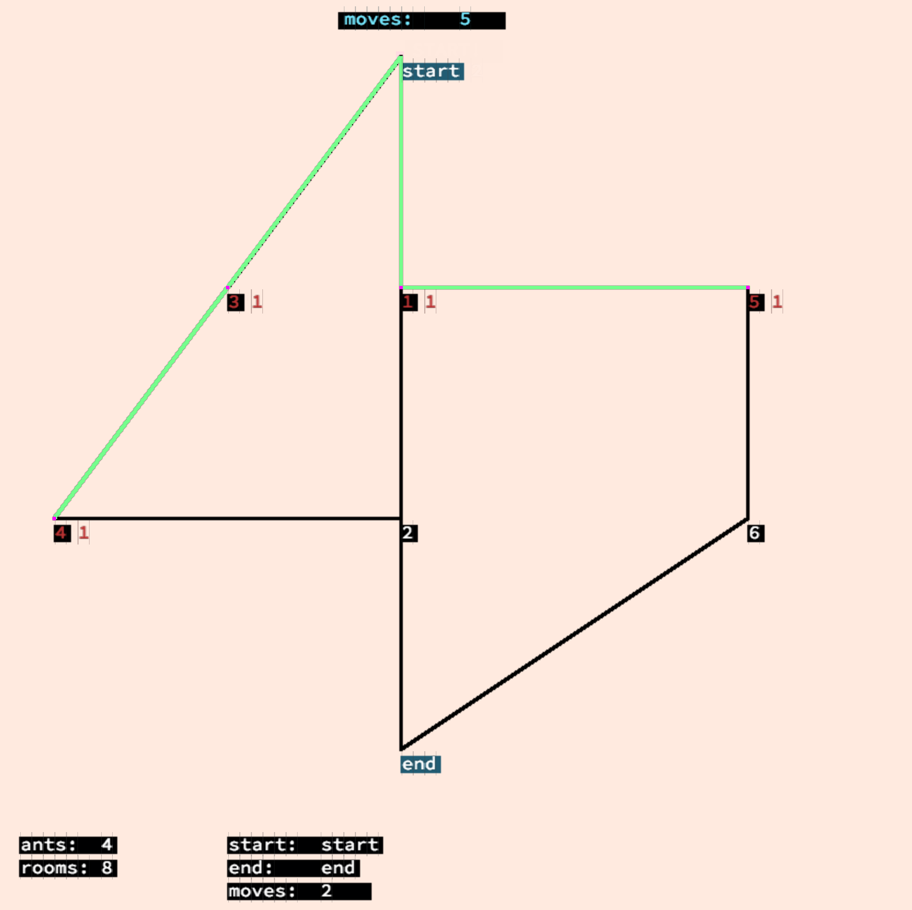
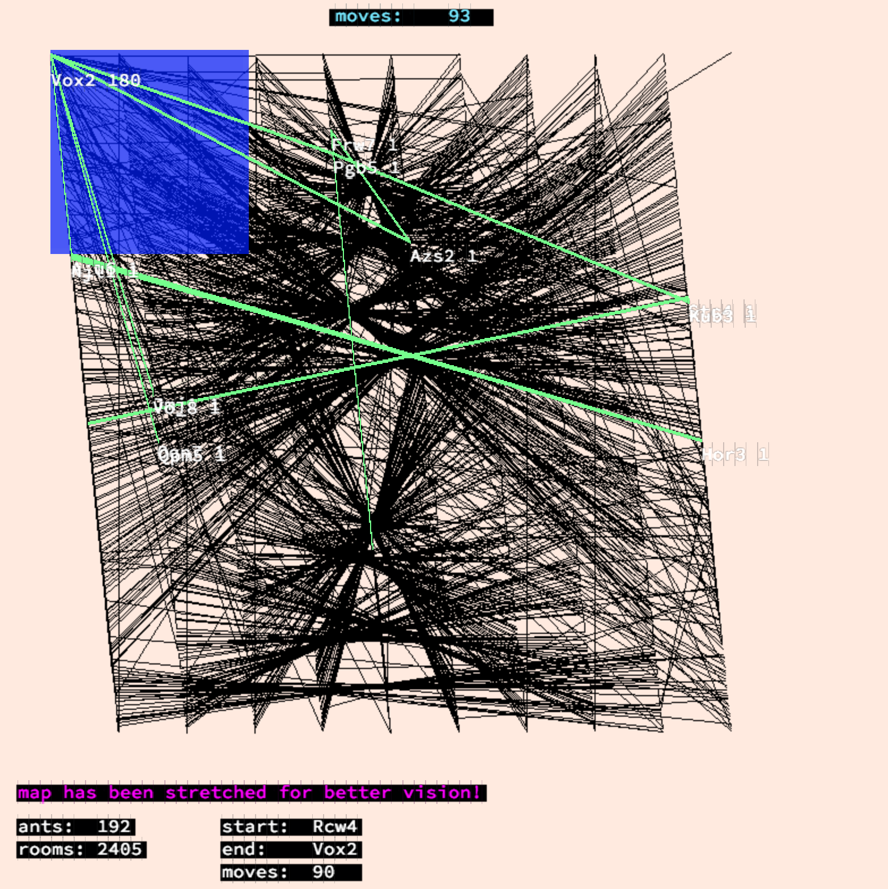

# Lem-in

- a Hive Helsinki school algorithm project Lem-in

- a bunch of ants finding their way through an ant farm defined in a specific ant farm data form. Ant farms rooms are linked to each other with tubes. Each room can have a limitless amount of rooms linked to it. In the beginning all ants are in start room. On each round, each ant can make one move to a free linked room. Goal is to get all ants into end room with as few rounds as possible.   

- ant farm example (displayed in the first picture):

		4		<-- amount of ants
		3 2 2		<-- room name, x-coord, y-coord
		##start	<-- indicates that next line will be the start room.
		start 4 0
		##end		<-- indicates that next line will be the end room.
		end 4 6
		4 0 4
		1 4 2
		2 4 4
		#comment lines can be anywhere and start with #.
		5 8 2
		6 8 4
		start-1	<-- here start link lines. room "start" is linked to room "1".
		3-4
		2-4
		##commands start with ##, this one is unknown and will be ignored.
		1-5
		6-5
		end-6
		1-2
		2-end
		3-start

- output:

		L1-1 L2-3
		L1-5 L2-4 L3-1 L4-3 
		L1-6 L2-2 L3-5 L4-4 
		L1-end L2-end L3-6 L4-2 
		L3-end L4-end		<-- in L3-end, 3 = ants name, end = the room it moves to.
						one line = one round. 

- usage (unvalid maps return ERROR; error specifications to be added):

		./lem-in < maps/[map]

- use map generator (options: flow-one / flow-ten / flow-thousand / big / big-superposition):

		cp lemtest/generator ./
		./generator --[option] | ./lem-in

- visual (press space to move ants):

		./lem-in < maps/[map] | vizu/visu

- for strecthed visual: 

		./generator --big-superposition | ./lem-in | vizu/visu 1

- to print stats with solution (with no visual), modify lem.h & recompile:
		
		# define ANTCOUNT 1
		make re

- test time & accuracy (first define ANTCOUNT back to 0):

		cd lemtest
		./lemtest.sh 	(for instructions)
		./lemtest.sh [generator option] [rounds]

- depending on the amount of ants and the ant farm structure, the shortest way isn't necessarily the fastest (upper picture). A small ant farm & a larger ant farm: 

